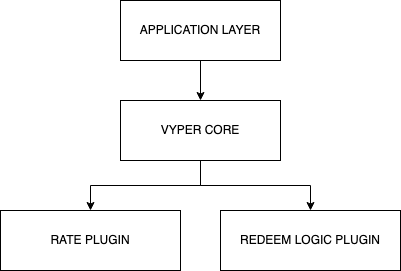

# Architecture

Vyper Core is an onchain primitive built keeping **composability** in mind. This took some effort but the final result is something flexible.

Vyper Core as a primitive is mainly meant to be integrate with some 3rd party product.

At an high level Vyper is composed by multiple Solana programs working together to provide user services. The main architecture can be synthetized as the following:

Where the application layer is the application integrating Vyper Core and the 3 other blocks are the vyper core components cooperating to provide derivatives infrastructure. Each component is a Solana Program and use one or more accounts to store data. The suite main entrypoint for integrating applications is provided by Vyper Core.

Following a brief overview of each component.

### Vyper Core

Vyper Core is the main program incapsulating the derivatives logic and orchestrating the 2 plugins.

### Rate Plugin

The Rate Plugin provide the system values (ie: prices) read from 3rd party accounts, for example on chain oracles. As of the time of writing we support Switchboard rate plugin and Pyth rate plugin.

### Redeem Logic Plugin

The redeem logic plugin provides the payoff logic, used to redeem user positions (LP tokens minted during deposit).
